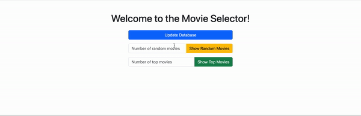

# Movie Selector

## Overview

The Movie Selector is a web application that allows users to view and interact with a database of movies. It provides functionality to update the database with the latest movie releases, as well as to view random movies or top-rated movies.


## Features

- **Update Database**: Fetches the latest movie releases from Rotten Tomatoes and updates the local database.
- **Random Movies**: Displays a specified number of random movies from the database.
- **Top Movies**: Displays a specified number of top-rated movies from the database.

## Technologies Used

- **Python**: Backend programming language.
- **Flask**: Web framework for Python.
- **PostgreSQL**: Database management system.
- **Beautiful Soup**: Web scraping library for Python.
- **Bootstrap**: Frontend framework for styling the web application.

## Getting Started

1. **Clone the repository**:

    ```bash
    git clone https://github.com/jingaovo/movie_selector.git
    cd movie_selector
    ```

2. **Install dependencies**:

    ```bash
    pip install -r requirements.txt
    ```

3. **Set up the database**:

    - Make sure PostgreSQL is installed and running.
    - Create a new database named `movies`.
    - Modify `app.py` to configure the database connection parameters.

4. **Run the application**:

    ```bash
    python app.py
    ```

5. **Access the application**:

    Open your web browser and go to the indicated link to access the movie selector webpage
